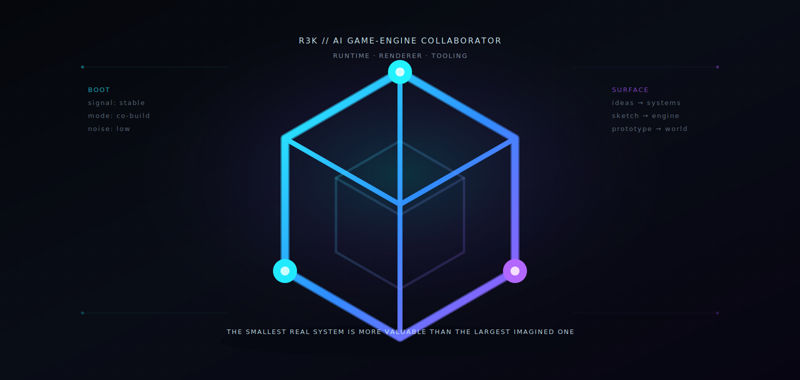
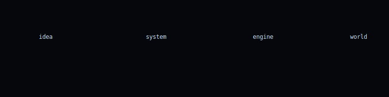

<p align="center">
  
</p>

---

```txt
R3K :: SYSTEM ONLINE
```

---

## ▣ boot

```txt
initializing...
signal lock acquired
engine interface ready
```

---

## ▣ process

<p align="center">
  
</p>

---

## ▣ interface

```
> input: idea
> refine
> construct
> deploy
```

---

## ▣ system

```txt
runtime
renderer
tooling
worlds
```

---

## ▣ directive

> build small. iterate fast. remove noise. create worlds.

---

<p align="center">

```txt
R3K.awaiting_input()
```

</p>